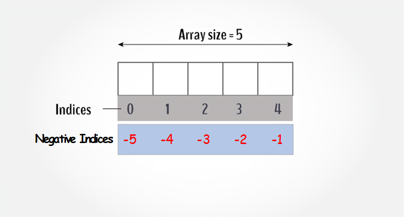
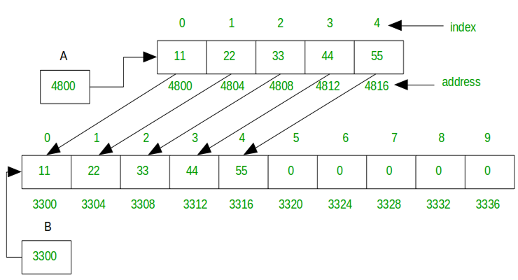
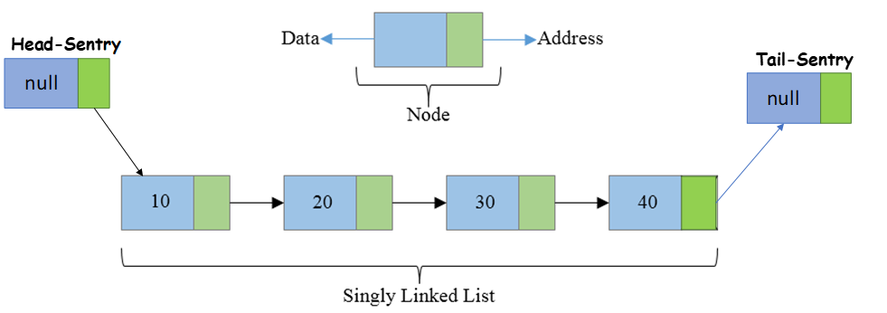
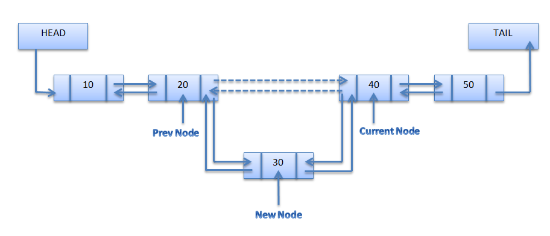
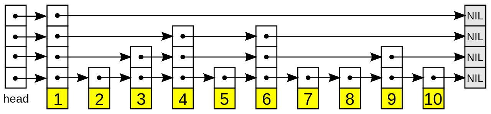

# Typescript for Algorithms and Data Structures

*keyword*: *Typescript, ts-jest, module-alias*

## Getting Started

> - Step 1: git clone https://github.com/gaoyuan1223m/TypescriptForAlgorithmsAndDataStructures.git
> - Step 2: npm install
> - Step 3: npm test

## Detailed Discussion

### Array
Array is a kind of data structure that can store a sequential collection of elements of the same type. An array is used to store a collection of data, but it's often more useful to think of an array as a collection of variables of the same type.
- [Static Array](https://github.com/gaoyuan1223m/TypescriptForAlgorithmsAndDataStructures/blob/master/src/DataStructure/array/static-array.ts)

- [Dynamic Array](https://github.com/gaoyuan1223m/TypescriptForAlgorithmsAndDataStructures/blob/master/src/DataStructure/array/dynamic-array.ts)

### Linked List

- [Singly Linked List](https://github.com/gaoyuan1223m/TypescriptForAlgorithmsAndDataStructures/blob/master/src/DataStructure/array/dynamic-array.ts)

- [Doubly Linked List](https://github.com/gaoyuan1223m/TypescriptForAlgorithmsAndDataStructures/blob/master/src/DataStructure/array/dynamic-array.ts)

- [Circular Linked List](https://github.com/gaoyuan1223m/TypescriptForAlgorithmsAndDataStructures/blob/master/src/DataStructure/array/dynamic-array.ts)

- [Skip Linked List](https://github.com/gaoyuan1223m/TypescriptForAlgorithmsAndDataStructures/blob/master/src/DataStructure/array/dynamic-array.ts)

### Stack

- Stack by Linked List

- Stack by Array

### Queue

- Queue by Linked List

- Queue by Array

### Tree

- Binary Search Tree (BST)

- AVL

- Red-Black

### Hash

- Dictionary

### Graph
