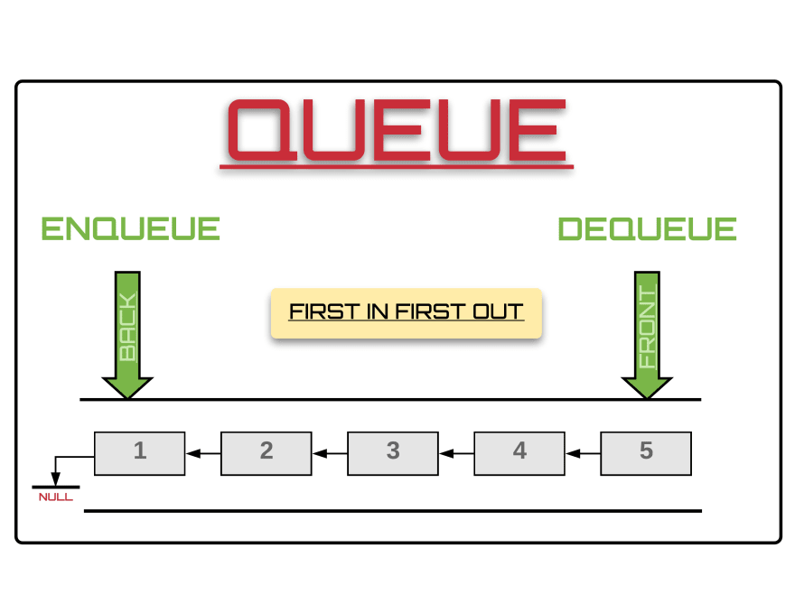
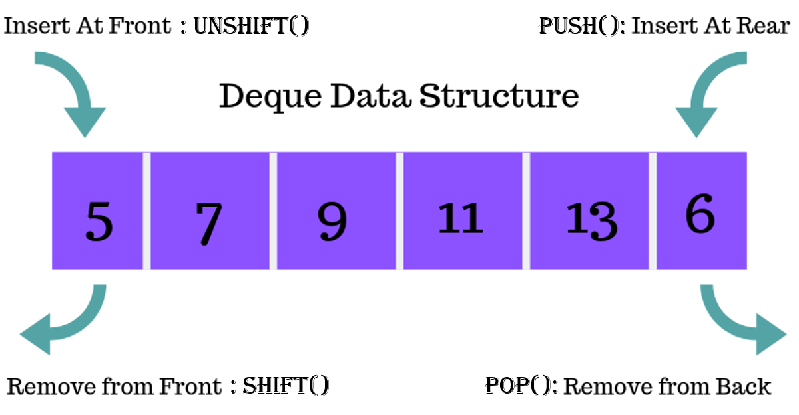

# Typescript for Algorithms and Data Structures

*keyword*: *Typescript, ts-jest, module-alias*


## Getting Started

> - Step 1: git clone https://github.com/gaoyuan1223m/TypescriptForAlgorithmsAndDataStructures.git
> - Step 2: npm install
> - Step 3: npm test

## Data Structures

### Array

Array refers to a sequence of elements which can be visited by their indices. Array can be created by **ArrayFactory** imported from this repo. Generic Method "*create<T>()*" in ArrayFactory recieves two parameters, first one is capacity of the Array to create, while second one, optional, is incremental of the Array. 

- [Static Array](https://github.com/gaoyuan1223m/Algorithms-and-Data-Structures-with-Typescript/blob/master/src/DataStructure/array/array.ts)

```
import { ArrayFactory } from "@DataStructure/array";

const capacity = 5;

const staticArray = ArrayFactory.create<number>(capacity);
```


- [Dynamic Array](https://github.com/gaoyuan1223m/Algorithms-and-Data-Structures-with-Typescript/blob/master/src/DataStructure/array/array.ts)

```
import { ArrayFactory } from "@DataStructure/array";

const capacity = 5, incremental = 5;

const dynamicArray = ArrayFactory.create<number>(capacity, incremental);
```


### Linked List

- [Singly Linked List](https://github.com/gaoyuan1223m/Algorithms-and-Data-Structures-with-Typescript/blob/master/src/DataStructure/linked-list/linked-list.ts)


- [Doubly Linked List](https://github.com/gaoyuan1223m/Algorithms-and-Data-Structures-with-Typescript/blob/master/src/DataStructure/linked-list/linked-list.ts)


- [Circular Linked List](https://github.com/gaoyuan1223m/Algorithms-and-Data-Structures-with-Typescript/blob/master/src/DataStructure/linked-list/linked-list.ts)


- [Skip Linked List](https://github.com/gaoyuan1223m/Algorithms-and-Data-Structures-with-Typescript/blob/master/src/DataStructure/linked-list/linked-list.ts)


### Stack

- [Stack](https://github.com/gaoyuan1223m/Algorithms-and-Data-Structures-with-Typescript/blob/master/src/DataStructure/stack-queue/stack.ts)


### Queue

- [Queue](https://github.com/gaoyuan1223m/Algorithms-and-Data-Structures-with-Typescript/blob/master/src/DataStructure/stack-queue/queue.ts)



### Deque

- [Deque](https://github.com/gaoyuan1223m/Algorithms-and-Data-Structures-with-Typescript/blob/master/src/DataStructure/stack-queue/deque.ts)



### Tree

- BST

- AVL

- RBT

### Hashing

- Dictionary

- UniqueSet

### Graph

- Direction


## Algorithms

### Sort
